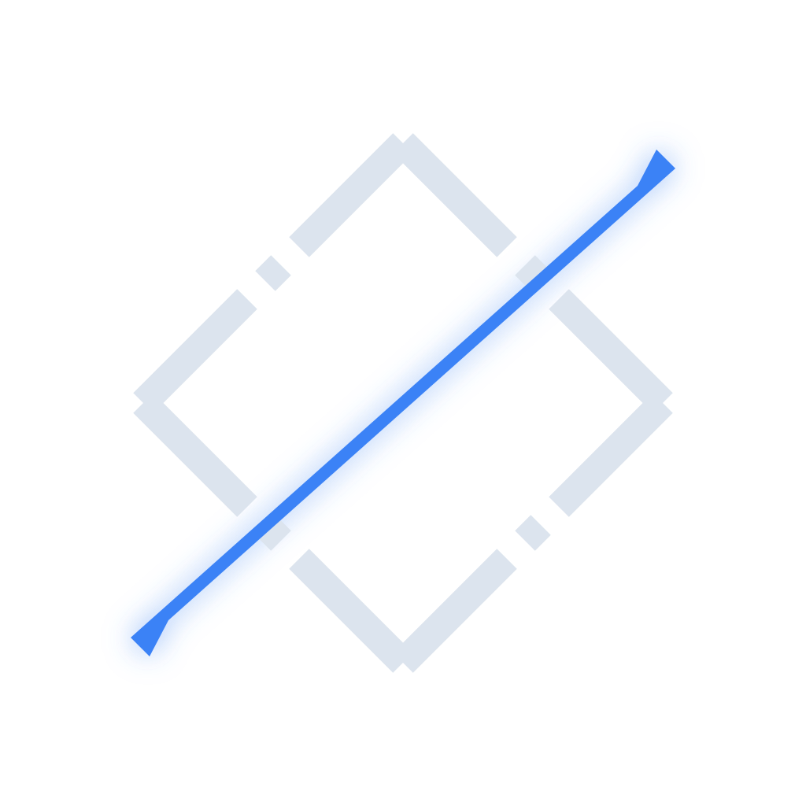

# TOC: Tactical Operations Center (Coptoc & Sigtoc)

[](https://opensource.org/licenses/Apache-2.0)
[](https://github.com/h4yd3n/toc/actions/workflows/test.yml)

A corporate-security **Tactical Operations Center**, built the way a military staff runs one:

- **Coptoc** — the Common Operating Picture: one wall with S1 personnel (blue force tracker, check-ins), S3 operations
  (travel, events, operations with tasks and S4 asks), S6 accountability (roll calls, check-in requests over SMS and
  chat, inbound replies, the 15-minute escalation rule), the watch (shifts, running estimates, the shift-change brief),
  and a hash-chained battle log. Web, iOS, and Android against one API.
- **Sigtoc** — the S2: requirements that write themselves from the wall, a collection plan that recommends its own
  sources, live collectors (GDACS, USGS, NWS, WHO, State Dept, FCDO; ACLED and CLSTR with keys), organic reports and
  cases with a suggest-then-confirm graph, the Area Assessment (candidates side by side, no score), and the daily INTSUM
  drafted at a fixed hour and released by the Battle Captain. Every product is disseminated and acknowledged on the record.
- **Modtoc** — a separate content-moderation engine that shares the ledger. Frozen; [ROOST](https://github.com/roostorg) covers most of it.

Everything is synthetic: people, sites, phone numbers, reports. Live feeds are real. Nothing needs a key to run.

## Why

> The entire concept of this COP was born from my years of experience working in tactical operations centers that
> run twenty-four seven — fusion centers, because they fuse S1, S2, S3, S4, S6, and other special sections, all there,
> twenty-four seven. In Iraq I worked a year as the S2, hand in hand with Ops, to plan current and future operations.
> Ops feeds Intel and Intel feeds Ops, but our sources are different: Ops has our own people on the ground; Intel has
> everyone else. The whole purpose of the TOC is to support ongoing operations.

The rest is in [PRD.md §1.1](PRD.md). The COP is the fusion cell. Sigtoc is the S2. Modtoc is queue work that
[ROOST](https://github.com/roostorg) has largely built already.

## Layout — three modules, one repo

```
toc/
├── coptoc/            # The COP — the wall a Battle Captain runs a shift from
│   ├── api/           #   FastAPI: S1 personnel, S3 travel/events, S6 roll calls (contract: api/COP_API_CONTRACT.md)
│   ├── web/           #   React + MapLibre — the wall
│   ├── ios/           #   SwiftUI + MapKit — the same wall on a phone
│   └── android/       #   Kotlin + Compose + MapLibre Native — the same wall on Android
├── sigtoc/            # S2 — requirements, collection plan, collectors, cases, area assessment, INTSUM, dissemination, the drafter
├── modtoc/            # Moderation engine — policy-as-code, severity × confidence routing, reach gates, evals. Separate tool.
├── shared/            # Models, database, the hash-chained ledger both APIs write to
├── tests/             # One folder per module + integration
├── PRD.md             # Product requirements — staff-section structure, decisions log
└── docs/archive/      # Superseded PRDs and the v1 MVP walkthrough (kept for the record)
```

**Coptoc** and **Sigtoc** are the product: the operations center. **Modtoc** is a different tool that shares the repo and the ledger — a content-moderation engine for a company that also runs a consumer platform. Sigtoc's `PolicyOverlayBridge` can feed it threat-driven policy updates; nothing in the COP depends on it.

## Quickstart

```bash
# Run all tests
make test

# The COP: API on :8000 and the wall on http://localhost:5173
make run-cop

# Sigtoc standalone on :8002 (it is also embedded in the COP as the S2 panel)
make run-s2

# The moderation engine on :8001, and its policy-diff eval harness
make run-mod
make diff

# Or separately
make run-api
make run-web

# Native iOS on the booted simulator (needs xcodegen)
make ios-run

# Native Android on a running emulator (Android Studio's bundled JDK is enough)
JAVA_HOME="/Applications/Android Studio.app/Contents/jbr/Contents/Home" make android-run

# Outbound SMS/Slack for roll calls and the S2 drafter are optional — copy .env.example and fill what you have.
# Unconfigured channels are recorded as SIMULATED, never as sent.

# Native clients build against coptoc/api/COP_API_CONTRACT.md
```

## Thirty minutes at the wall

Open the wall as the Battle Captain. Take the watch. Press **COLLECT** and watch six live sources fill the threat
list; the requirements' coverage bars move. Open the S2 **REQUIREMENTS** panel, tick Lisbon and Porto, press
**ASSESS**: the Area Assessment lays the two candidates side by side with reported, quiet, and not-collected cells and
no score. Open the seeded case **North gate loiterer** and work its review queue: every suggestion cites the report
line it came from. Open a roll call on London, request check-ins (simulated unless Twilio and Slack are configured),
and watch the fifteen-minute rule float the silent names to the top. Confirm the link on the DC-East threat and press
**RUN RULE** under WARNINGS: the rule proposes a FLASH; release it and it goes out over SMS and chat (simulated) and
sits red across the top of every client until each role acknowledges. Open **PLAN 90d** on the S3 panel and assign
security to the board meeting. Open **INTSUM**: the day's diff, drafted at the fixed hour, waiting for your release.
Then hand over — the brief freezes, and the incoming Battle Captain must acknowledge every item that arrived during
the overlap.

Every one of those actions is on the battle log, hash-chained, with who did it and why.

## Before you deploy

This is a prototype built to be read and run locally. It has **no authentication**: the role and the actor come from
two request headers (`X-TOC-Role`, `X-TOC-Actor`), which is what lets one screen switch identities for a demo. The
API allows any CORS origin. Cleartext HTTP is allowed only for the dev hosts the phones use. The check-in and roll-call
links are HMAC tokens signed with `TOC_SECRET`, which defaults to a dev value. Twilio, Slack, ACLED, CLSTR, and the
S2 drafter's model are all off until their keys are in the environment, and everything they would have done is
recorded as *simulated* — never as sent. Put an identity layer, TLS, and a real database in front of it before any
of this touches real people.
